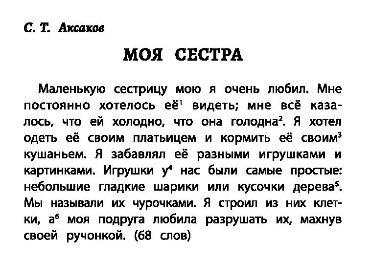

# verfessbot
Тестовый проект для Университет НЕЙМАРК (НИУ ВШЭ (НН) / ТИДИ)

## Проблемы и целевая аудитория 
    
Целевая аудитория: школьники

Проблема: Требуется срочно выучить содержание текста.

## Идеи и сценарии работы бота

Школьник фотографирует необходимый для изучения текст
(разворот учебника), бот представляет краткую выжимку
этого текста, которую можно выучить за минуту.

## Используемые технологии и ИИ-инструменты

Python — основной язык программирования

aiogram — библиотека для взаимодействия с Telegram API.

Yandex OCR — для оптического распознавания символов, извлечения текста из изображений.

Yandex GPT — для генерации краткого содержания текста.

## Архитектура и структура проекта

Структура проекта:

* **main.py** - Главный файл, запускающий бота
* **handlers.py** - Обработчики сообщений и команд
* **yandexservices.py** - Модуль для работы с Yandex GPT и Yandex OCR
* **requirements.txt** - Список зависимостей проекта

## Инструкция по запуску

1. В telegram в поиске набрать @verfessbot
2. Нажать СТАРТ

## Сборка проекта

Требуется python версии >= 3.9

```shell
$ python3 -m venv .venv
$ source .venv/bin/activate
$ pip3 install -r requirements.txt
```

Создать локальный .env файл и прописать в нем TG_TOKEN, YANDEX_API_KEY, YANDEX_FOLDER_ID

```shell
$ python3 main.py
```

## Примеры работы бота:

### Пример 1

Пользователь вводит начало поэмы «Руслан и Людмила» (первые 33 строчки)

**Бот отвечает:** (краткая выжимка по тексту)

```text
В стихотворении описывается фантастический мир у
лукоморья, где присутствуют волшебные существа и
явления: зелёный дуб с золотой цепью, учёный кот,
леший, русалка, избушка на курьих ножках, тридцать
витязей, морской дядька, колдун, богатырь, царевна,
бурый волк, Баба-Яга и царь Кащей. Описываются
различные чудеса и приключения, характерные для
русских сказок.
```

### Пример 2

Пользователь отсылает в телеграм-бот фото страницы учебника:



**Бот отвечает:** (распознанный текст и краткая выжимка)

```text
C. Т. Аксаков
МОЯ СЕСТРА
Маленькую сестрицу мою я очень любил. Мне
постоянно хотелось её' видеть; мне всё каза-
лось, что ей холодно, что она голодна2. Я хотел
одеть её своим платьицем и кормить её своим3
кушаньем. Я забавлял её разными игрушками и
картинками. Игрушки у* нас были самые простые:
небольшие гладкие шарики или кусочки дерева5.
Мы называли их чурочками. Я строил из них клет-
ки, а° моя подруга любила разрушать их, махнув
своей ручонкой. (68 слов)
```
```text
В рассказе С. Т. Аксакова «Моя сестра» говорится о
нежной привязанности брата к младшей сестре. Он
заботится о ней, делится с ней своими вещами и
забавляет её игрушками и картинками. Игрушки у
детей простые — гладкие шарики или кусочки дерева,
из которых брат строит клетки, а сестра их разрушает.
```
